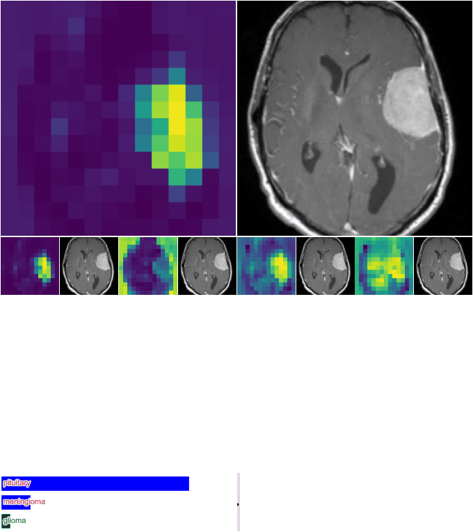

# 🧠 Brain Tumor Classification using Continuous Thought Machine (CTM)

This repository contains the code and training pipeline for a **brain tumor classification model** built using the novel [Continuous Thought Machine (CTM)](https://github.com/SakanaAI/continuous-thought-machines) architecture by Sakana AI.

Unlike traditional deep learning models, CTM mimics **temporal reasoning** by allowing neurons to synchronize over time — producing interpretable internal dynamics. We leverage this to classify MRI scans of the brain and visualize how the model's attention shifts over time during its decision-making process.

---

## 🚀 Highlights

- 🧠 **CTM Architecture** — Neuron-level temporal dynamics for internal “thinking steps.”
- 📊 **MRI-based Brain Tumor Classification** — Trained on annotated scan datasets.
- 🔍 **Explainability via Attention GIFs** — Watch the model's attention evolve across internal ticks.
- 💡 **Modular & Reproducible** — Clean structure with pluggable config and reproducible runs.

---

## 🧪 Training Configuration

| Parameter     | Value                     |
| ------------- | ------------------------- |
| Backbone      | `resnet18-4`              |
| CTM Memory    | `25`, deep memory enabled |
| Batch Size    | `32`                      |
| Learning Rate | `1e-3`                    |
| Scheduler     | Warmup + Cosine           |
| Iterations    | `10001`                   |
| Eval Batches  | `20`                      |
| Device        | Auto (CUDA/CPU)           |

---


## Results


- **Test Loss:**  0.0156
- **Test Accuracy:** 0.9962

 

## 📽 Explainability Example

> CTM’s attention evolves over time — below is a GIF of the model progressively focusing on different regions of an MRI scan as it determines the presence of a tumor.



---

## 💾 Getting Started

### 1. Clone the repository

```bash
git clone https://github.com/yourusername/ctm-brain-tumor-classification.git
cd ctm-brain-tumor-classification

2. Install dependencies

pip install -r requirements.txt

3. Prepare the dataset

Place your MRI scan dataset inside the dataset/ directory. You can adapt data.py to fit your format (DICOM, PNG, etc.).
4. Train the model

jupyter notebook train.ipynb

🧠 About Continuous Thought Machine

    CTM is a biologically inspired AI architecture that enables internal synchronization and adaptive reasoning over time. Instead of static one-shot inference, CTM models gradually refine their predictions, offering temporal explainability — a game-changer for high-stakes fields like healthcare.

📚 Citation

If you use this project or the attention visualization in your work, please consider citing Sakana AI’s original CTM paper:

@article{darlow2025ctm,
  title={Continuous Thought Machines},
  author={Darlow, Luke N and others},
  journal={arXiv preprint arXiv:2505.05522},
  year={2025}
}

Dataset: https://www.kaggle.com/datasets/adityakomaravolu/brain-tumor-mri-images
```
